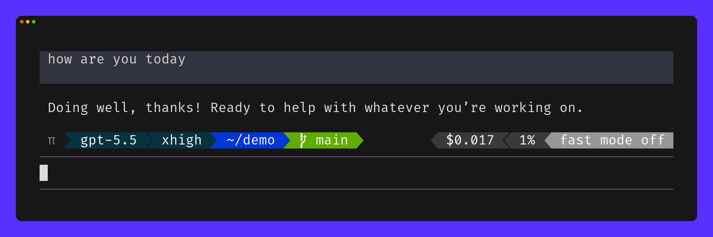

# customizable-powerline-for-pi

A tiny, themeable, Agnoster-ish powerline for [Pi](https://github.com/earendil-works/pi-coding-agent), replacing the stock footer with a powerline status bar inspired by the agnoster theme.



> [!IMPORTANT]
> Proper rendering requires a font with Powerline/Nerd Font glyphs. Install one from [Nerd Fonts](https://www.nerdfonts.com/) if separators or icons appear as boxes.

## Install

Install it with Pi's package manager:

```bash
pi install git:github.com/fabiangigler/customizable-powerline-for-pi
```

Then reload Pi:

```text
/reload
```

## Commands

```text
/powerline
```

Toggles the bar on/off.

```text
/powerline:status
```

Shows whether the bar is enabled and which theme is active.

```text
/powerline:publish dark
```

Publishes a named global theme to:

```text
~/.pi/agent/customizable-powerline-for-pi/themes/dark.ts
```

Existing files are protected. To reset it to the default on purpose:

```text
/powerline:publish --force dark
```

```text
/powerline:theme dark
```

Switches to a named theme.

## How themes work

`default` is the built-in Agnoster-style theme. The extension also ships `agnoster-tokens`, which adds a token-cost bar on the right.

`/powerline:publish <name>` writes a complete editable global theme file. For bundled themes such as `agnoster-tokens`, it publishes that bundled source; otherwise it starts from `default`.

Local project themes can override bundled and global themes by using the same name under any `.pi` folder from the current directory upward:

```text
.pi/customizable-powerline-for-pi/themes/<name>.ts
```

Nearest local themes win over parent-directory themes, local themes win over global themes, and global themes win over bundled themes.

A few useful notes:

- `placement` can be `"aboveEditor"`, `"belowEditor"`, or `"footer"`.
- `hideFooter` and `hideWorking` control Pi's native footer/working indicator while the powerline is active.
- `left` segments render in listed order.
- `right` segments are listed from the outside edge inward. The first item appears at the far right.
- Segment `value` callbacks return text, `null`, or `undefined`; empty values hide the segment.
- `color`, `separatorAfter`, and `separatorAfterFg` can be static values or runtime callbacks.
- Segment arrays accept `false`, `null`, and `undefined` for conditional inclusion.
- Segment text gets a default single-space pad on both sides.
- Segments are fully dynamic TypeScript callbacks and can show anything available to Pi, including model/session state, filesystem data, shell command output, or arbitrary network/API requests.

Segment callbacks receive `ctx`, `data`, `config`, and a per-render `memo` map. `data.fg(key, text)` can color text with Pi theme keys like `thinkingText`, `muted`, `warning`, or `error` when Pi exposes them.

## How it works internally

On `session_start`, the extension loads the active theme, installs a Pi widget (or footer renderer), and optionally hides Pi's native footer/working indicator according to the theme. Segment callbacks produce strings, colors are converted to ANSI, and the final line is width-truncated.

The extension refreshes the animation on a short interval, but it does **not** reload the theme on every frame. Edit a theme and run `/reload` or `/powerline:theme <name>` to reload it.

Toggle state and the selected named theme are stored globally at `~/.pi/agent/customizable-powerline-for-pi/state.json`, so they apply across Pi sessions and projects.

## Development

Run smoke tests:

```bash
node .pi/extensions/customizable-powerline-for-pi/src/test.ts
```

Validate syntax only:

```bash
find .pi/extensions/customizable-powerline-for-pi/src -name '*.ts' -print0 | xargs -0 -n1 node --check
node --check .pi/extensions/fast-mode-for-pi/index.ts
```

See `TESTING.md` for the lightweight test plan.
